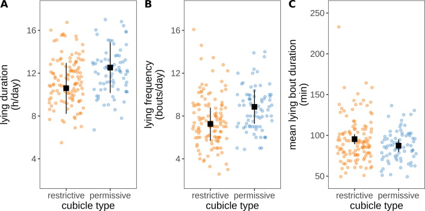

\newcommand{\CO}{\mathrm{CO}_2}
\newcommand{\vw}{\mathrm{voerwinst}}
\newcommand{\mpr}{\mathrm{mp}}
\newcommand{\vk}{\mathrm{voerkosten}}
\newcommand{\DVE}{\mathrm{DVE}}
\newcommand{\E}{\mathrm{E}}


```{r,echo = FALSE,results='hide',message = FALSE,warning = FALSE}
knitr::opts_chunk$set(warning = FALSE, message = FALSE)
packages <- c("knitr",
              "shiny",
              "echarts4r",
              "openxlsx",
              "dplyr",
              "stringr",
              "gt")

installed_packages <- packages %in% rownames(installed.packages())
if (any(installed_packages == FALSE))
  install.packages(packages[!installed_packages])
invisible(lapply(packages, library, character.only = TRUE))
ipad <- "beelden"
dpad <- "data_en_code"
spad <- "stijlen"
load(file.path(dpad,"20250402.Rdata"))
```

# Opzet

1. Kennismaking
2. Achtergrond: energie en eiwitvoorziening, hoe werkt het?
3. Eiwitvoorziening; hoe bereiken we goede benutting?
4. Leren van data: verloop over jaar

# 1. Kennismaking

- Albart Coster
- Opleiding Dierwetenschappen in Wageningen, afstudeerrichtingen Veevoeding en Fokkerij
- Promotietraject Fokkerij en Genetica, gebruik van genetische merkers in fokprogramma's
- Samen met Jaap van Zwieten: start Dairyconsult in 2006
- Dairyconsult biedt onafhankelijk advies voor melkveehouders. Gericht op veevoeding, met veel aandacht voor (ruw)voerwinning en voor data.

# 2. Achtergrond. Energievoorziening

We kennen VEM. VEM is een maat voor Netto Energie:

{width=50%}


# 2. Achtergrond. Verbrandingsenergie

{width=50%}

We kunnen het ook berekenen:


```{r,echo=FALSE,results = 'asis'}
tab0 <- data.frame(Nutrient = c("Zetmeel",
                                "Vet",
                                "NDF",
                                "RE",
                                "ROM"),
                   VE = c(17.7,
                          39.33,
                          17.6,
                          23.63,
                          16.73)) |> 
  gt(rowname_col = "Nutrient") |> 
  cols_label(VE = "VE waarde(MJ/kg)") |> 
  tab_footnote("ROM = rest van suikers, vetzuren, glycerol, oplosbare vezel") |> 
  tab_footnote("@nrc2021")

tab0
```

- Internationale eenheid voor energie is Joule. 1000 VEM = 6900 MJoule.


# 2. Achtergrond. Verteerbare energie

Moet experimenteel vaststeld worden:

{width=50%}

Belangrijke concepten:

- Verteerbaarheid wordt beïnvloed door behandeling van grondstof:

```{r,echo=FALSE,results = 'asis'}
tab1 <- data.frame(Behandeling = c("Standaard gemalen",
                                   'Fijn gemalen $$(< 1.25\\mu m)$$',
                                   'Matig gemalen $$(1.5 - 3.25 \\mu m)$$',
                                   'CCM zeer fijn gemalen $$($<2 \\mu)$$',
                                   "Maisvlokken"),
                   Verteerbaarheid = c(92,
                                       92,
                                       89,
                                       96,
                                       94)) |> 
  mutate(Verteerbaarheid = paste(Verteerbaarheid,"%")) |> 
  gt(rowname_col = "Behandeling") |> 
  tab_footnote("@nrc2021")

tab1
```

- Verteerbaarheid wordt bepaald door opname. Bij hogere opname lagere verteerbaarheid.
- Grondstoffen beïnvloeden elkaars verteerbaarheid (zetmeel verlaagt NDF verteerbaarheid, vetten beïnvloeden elkaars verteerbaarheid en NDF verteerbaarheid)

# 2. Achtergrond. Energiebehoefte

```{r,echo=FALSE,results='asis'}
tab <- data.frame(c(Groei = "23.4 MJ/kg LW",
         Onderhoud = "$$1.51 + 0.405\\cdot\\textrm{vet}\\%$$",
         Melkproductie = "$$1.51 + 0.405\\cdot\\textrm{vet}\\%$$",
         Kalf = "vanaf 200 dagen dracht belangrijk",
         Activiteit = "$$1.46\\textrm{MJ}/(\\textrm{kg LW}\\cdot\\textrm{km})$$"))
colnames(tab) <- "Energie"
tab$doel <- rownames(tab)

gt(tab,rowname_col = "doel") |> 
  tab_header("Energiebehoefte per doel") |> 
  tab_stubhead("Doel")

```

# 2. Achtergrond. Eiwit


# 2. Achtergrond. DVE

Opbouw DVE:

$\textrm{DVE} = \textrm{DVBE} + \textrm{DVME} - \textrm{DVFE}$

$\textrm{DVME} = 0.75\cdot0.85\cdot\textrm{MREE}$

$\textrm{MREE} = 0.15\cdot{FOS}$

# 2. Achtergrond. Behoefte aan DVE en VEM

```{r,echo=FALSE,results='asis'}
tab12 <- read.xlsx("beelden/20250402_tabellen.xlsx",
                   sheet = "tab12cvb",
                   colNames = FALSE)


tab12 |> gt(id="two",rowname_col = "X1") |> 
  tab_stubhead(label = "Productie") |> 
  tab_header(title = "VEM en DVE behoeftes voor oplopende melkproductie") |> 
  tab_spanner(label = "3.5% vet, 3.03% eiwit",columns  = c(X2,X3)) |> 
  tab_spanner(label = "3.75% vet, 3.18% eiwit",columns  = c(X4,X5)) |> 
  tab_spanner(label = "4.00% vet, 3.32% eiwit",columns  = c(X6,X7)) |> 
  tab_spanner(label = "4.25% vet, 3.45% eiwit",columns  = c(X8,X9)) |> 
  cols_label(X2 = "VEM",
             X3 = "DVE",
             X4 = "VEM",
             X5 = "DVE",
             X6 = "VEM",
             X7 = "DVE",
             X8 = "VEM",
             X9 = "DVE") |> 
  opt_css(
    css = "
    .cell-output-display {
      overflow-x: unset !important;
    }
    div#two {
      overflow-x: unset !important;
      overflow-y: unset !important;
    }
    #two .gt_col_heading {
      position: sticky !important;
      top: 0 !important;
    }
    ")
```

<div class="rf">
Bron: @cvbboekje
</div>


# Toepassingen

1. Eiwit naar behoefte voeren
2. Zorgen voor goede kuilen
3. Verloop productie over jaar

# Toepassing 1. Eiwit naar behoefte voeren

Voer dieren naar behoefte:


We spreken over *Darm Verteerbaar Eiwit*, **DVE**

- Onderhoud: $\DVE{}_{(g/dag)} = (2,75 \cdot \mathrm{lg}^{0,5} + 0,2 \cdot \mathrm{lg}\cdot{0,6})/0,67$

```{r}
DVE_onderhoud = (2.75*750^0.5 + 0.2*750^0.6)/0.67
DVE_onderhoud
```
- Productie: $\DVE{}_{(g/dag)} = \mpr{}\cdot \E{}\cdot1,396 + (\mpr{}\cdot \E{})^2\cdot 0,000195$
```{r,echo = TRUE}
DVE_productie_50kg = 50 * 33*1.396 + (50*33)^2*0.000195
DVE_productie_50kg
DVE_productie_50kg + DVE_onderhoud
##
DVE_productie_25kg = 25 * 36*1.396 + (25*36)^2*0.000195
DVE_productie_25kg
DVE_productie_25kg + DVE_onderhoud
```

<div class="rf">
Bron: @cvbboekje
</div>

#  Toepassing 1. Eiwit naar behoefte voeren, nog meer bewijs

```{r ureum,eval=FALSE}
grafiek_ureum(df)
```

#  Toepassing 1. Eiwit naar behoefte voeren. Experimenteel bewijs


Bron: @Larsen2014

# Eiwitbenutting Ruwvoerwinning

Belangrijkste punt: verbeter kuilgras

{width=30%}
<div class="rf"> Bron: @aschenbach2019 </div>

```{r,echo=FALSE,results='asis'}
t1 <- data.frame(Kenmerk = c("LPS",
                             "Methylalanine",
                             "Putrescine",
                             "Cadaverine",
                             "Histamine"),
                 basis= c(14692,37.3,14,15.9,2.03),
                 Sara1 = c(131209,37.3,32.2,24.2,13),
                 Sara2 = c(168285,46,30.7,24.3,5.19))
gt(t1)
```


<div class="rf"> Bron: @humer2018 </div>


<div class="rf"> Bron: @pieper2009 </div>

# Ruwvoerwinning. Snel drogen

```{r,echo=FALSE,results='asis'}
tabc <- read.xlsx("beelden/20250402_tabellen.xlsx",
                   sheet = "tab1cavallarin2005",
                   colNames = FALSE)

rc <- function(x){
  round(as.numeric(str_trim(gsub("[a-z]","",x))),2)
}

tabc |> 
  mutate(across(colnames(tabc)[-1],rc)) |> 
  gt(id="three",rowname_col = "X1") |> 
  tab_stubhead(label = "Kenmerk") |> 
  tab_header(title = "Invloed kneuzen en drogen op kwaliteit Sainfoin.") |> 
  tab_spanner(label = "Ongekneusd",columns  = c(X3,X5)) |> 
  tab_spanner(label = "Gekneusd",columns  = c(X6,X8)) |> 
  cols_label(X2 = "0",
             X3 = "25",
             X4 = "71",
             X5 = "77",
             X6 = "5",
             X7 = "25",
             X8 = "29") |> 
  opt_css(
    css = "
    .cell-output-display {
      overflow-x: unset !important;
    }
    div#two {
      overflow-x: unset !important;
      overflow-y: unset !important;
    }
    #two .gt_col_heading {
      position: sticky !important;
      top: 0 !important;
    }
    ")
```
<div class="rf"> Bron: @Cavallarin2005 </div>

- Snelheid van drogen bepaalt kwaliteitsverliezen
- Snelheid belangrijker dan uiteindelijke DS-percentage

Snelheid van drogen wordt beïnvloed door:

Kneuzen en schudden

```{r,echo=FALSE,results='asis'}
tabsb <- read.xlsx("beelden/20250402_tabellen.xlsx",
                   sheet = "tabsborreani1999",
                   colNames = TRUE)

tabsb |> 
  select(-Trial) |> 
  gt(id="four",rowname_col = "Systeem") |> 
  tab_stubhead(label = "Kenmerk") |> 
  tab_header(title = "Invloed van kneuzen en schudden op droogsnelheid.") |> 
  tab_spanner(label = "Droogsnelheid",columns  = c(S1,S2)) |> 
  tab_spanner(label = "% van controle",columns  = c(perc1,perc2)) |> 
  cols_label(S1 = "Ongeschud",
             S2 = "Geschud",
             perc1 = "Ongeschud",
             perc2 = "Geschud") |> 
  tab_footnote("letters geven significante verschillen aan.")|> 
  tab_row_group(label = "Gras",rows= 1:12)|> 
  tab_row_group(label ="Luzerne",rows= 13:24) |> 
  opt_css(
    css = "
    .cell-output-display {
      overflow-x: unset !important;
    }
    div#two {
      overflow-x: unset !important;
      overflow-y: unset !important;
    }
    #two .gt_col_heading {
      position: sticky !important;
      top: 0 !important;
    }
    ")
```

<div class="rf"> Bron: @Borreani1999 </div>

Moment van schudden maakt echter ook uit:


<div class="rf"> Bron: @Savoie2002 </div>

En droogte van ondergrond ook 

# Ruwvoerwinning. Intermezzo: tijd van drogen en vitamine D

Vitamine D gehalte in gras neemt toe tijdens de veldperiode:

```{r,echo=FALSE,results='asis'}
tabnl <- read.xlsx("beelden/20250402_tabellen.xlsx",
                   sheet = "tab2newlander1952",
                   colNames = TRUE)

tabnl |> 
    select(-c(No,Gewas)) |> 
  gt(id="five",rowname_col = "Systeem") |> 
  tab_row_group("Spaanse Dravik en Luzerne, gemaaid 28/6/1950 7:00",
                rows = 1:4) |> 
  tab_row_group("2e S. Luzerne, gemaaid 15/8-1950 7:00",
                rows = 5:7) |> 
  tab_row_group("Spaanse Dravik, gemaaid 21-6-1951 13:30",
                rows = 8:10) |> 
  tab_row_group("Luzerne, gemaaid 21-6-1951 13:30",
                rows = 11:13) |> 
  tab_row_group("Spaanse Dravik, gemaaid 11-7-1951 11:00",
                rows = 8:10) |> 
  tab_header(title = "Invloed van tijd en weer op Vit D3 gehalte in grassen.") 
```

<div class="rf"> Bron: @Newlander1952 </div>

# Ruwvoerwinning. Snel conserveren

Verliezen gaan na het inkuilen door tot pH stabiel (laag) is. pH van kuil daalt als er melkzuur wordt gevormd. Dat wordt pas gevormd als zuurstof in kuil op is. 


```{r,echo=FALSE,results='asis'}
tabd <- read.xlsx("beelden/20250402_tabellen.xlsx",
                   sheet = "tab2davies1998",
                   colNames = TRUE)

tabd |> 
  gt(id="six",rowname_col = "Waarde") |> 
  tab_footnote("letters geven significante verschillen aan")
```

<div class="rf">Bron: @Davies1998 </div>

# Ruwvoerwinning: hakselen en aanrijden

```{r,echo=FALSE,results='asis'}
tabp <- read.xlsx("beelden/20250402_tabellen.xlsx",
                   sheet = "tab3pauly1999",
                   colNames = TRUE)

tabp |>
  select(-Forage.treatment) |> 
  gt(id="seven",rowname_col = "Density") |> 
    tab_header("Invloed van techniek en aanrijden op silagekwaliteit.") |> 
  tab_row_group("FW 26 cm",rows = 1:2) |> 
  tab_row_group("FW 4 cm",rows = 3:4) |> 
  tab_row_group("PC 4 cm",rows = 5:6) 
```

<div class="rf">Bron: @Pauly1999</div>

# Ruwvoerwinning: afdekken


```{r,echo=FALSE,results='asis'}
tabl1 <- read.xlsx("beelden/20250402_tabellen.xlsx",
                   sheet = "tab1lima2017",
                   colNames = TRUE)

tabl1 |>
  gt(id="eight",rowname_col = "Item") |> 
    tab_header("Eigenschappen van folie in onderzoek.")


tabl3 <- read.xlsx("beelden/20250402_tabellen.xlsx",
                   sheet = "tab3lima2017",
                   colNames = TRUE) 

tabl3 |> gt(id = "nine",rowname_col = 'item') |> 
  tab_header("Microbiële en fermentatieeigenschappen van kuilen.")

tabl4 <- read.xlsx("beelden/20250402_tabellen.xlsx",
                   sheet = "tab4lima2017",
                   colNames = TRUE)

tabl4 |> gt(id = "ten",rowname_col = 'item') |> 
  tab_header("Voederwaarde op verschillende plekken in kuilen.") 
```

<div class="rf">Bron: @Lima2017</div>

# Ruwvoerwinning: inkuilmiddel


<div class="rf">Bron: @Davies1998</div>

```{r,echo=FALSE,results='asis'}
tablk <- read.xlsx("beelden/20250402_tabellen.xlsx",
                   sheet = "tab2kristensen2010",
                   colNames = FALSE)

tablk |>
  mutate(across(colnames(tablk)[-1],rc)) |> 
  gt(id="eleven",rowname_col = "X1") |> 
  tab_header("Eigenschappen van kuilen ingekuild met drie verschillende inkuilmiddelen over de tijd.") |> 
  tab_spanner(label = "January",columns  = c(X2,X4)) |> 
  tab_spanner(label = "April",columns  = c(X5,X7)) |> 
  tab_spanner(label = "August",columns  = c(X8,X10)) |>
  sub_missing(columns = everything(),missing_text = "") |> 
  cols_label(X2 = "Control",
             X3 = "Lactsil",
             X4 = "Lactisil Fresh",
             X5 = "Control",
             X6 = "Lactsil",
             X7 = "Lactisil Fresh",
             X8 = "Control",
             X9 = "Lactsil",
             X10 = "Lactisil Fresh") |> 
  opt_css(
    css = "
    .cell-output-display {
      overflow-x: unset !important;
    }
    div#eleven {
      overflow-x: unset !important;
      overflow-y: unset !important;
    }
    #eleven .gt_col_heading {
      position: sticky !important;
      top: 0 !important;
    }
    ")
```

<div class="rf">Bron: @Kristensen2010</div>

- Voor behoud van eiwitkwaliteit: homofermentative middelen
- Voor aerobe stabiliteit: mengsel van homo- en heterofermentatieve middelen

# Ruwvoerwinning: Inkuilen onder (zeer) moeilijke omstandigheden

```{r,echo=FALSE,results='asis'}
tabpiep <- read.xlsx("beelden/20250402_tabellen.xlsx",
                   sheet = "table1pieper2009",
                   colNames =TRUE)

tabpiep |>
  select(-2) |> 
  mutate(across(colnames(tabpiep)[-(1:2)],rc)) |> 
  gt(id="twelve",rowname_col = "X1") |> 
  tab_header("Eigenschappen van uitgangsmateriaal.")
```


<div class="rf">Bron: @pieper2009</div>

hier filmpjes van gras +  maismengsel
-- 
--  
--  
--  


# Ruwvoerwinning: Intermezzo: eiwitafbraak en rode klaver

Rode klaver bevat een enzym dat proteolyse remt:

```{r,echo=FALSE,results='asis'}
tabli <- read.xlsx("beelden/20250402_tabellen.xlsx",
                   sheet = "tab2li2018",
                   colNames =TRUE)
 

tabli |> 
  filter(!is.na(R0)) |> 
  mutate(across(colnames(tabli)[-(1)],rc)) |> 
  gt(id="thirteen",rowname_col = "Item") |> 
  tab_header("Invloed van toenemend aandeel rode klaver in luzernekuil.")
```


<div class="rf">Bron: @Li2018</div>

# Ruwvoerwinning: Samenvatting

- Snelheid van drogen
- Snelheid van conserveren


# Eiwitbenutting 2. Verdeling van ruwvoer over groepen

Aanwijzingen:

1. Voer jongvee naar behoefte. Laat ouder jongvee weiden. Zorg dat ze geen eiwitrijk, ingekuild najaarsgras eten.
2. Voer drogen naar behoefte en goed.
3. Probeer ook melkkoeien in najaar te weiden of te stalvoeren. Benut zo eiwitrijke najaarsgras.
4. Kuil eiwitrijke gras zo in dat je het graag aan melkkoeien voert.

# Verloop van productie over jaren

```{r productie,eval=FALSE}
grafiek_productie(df2)
```

<small>
Legenda: FR,K,KI
</small>


# Verloop van celgetal over jaren


```{r celgetal,eval =FALSE}
grafiek_celclasses(df,FALSE)
```

<small>
Legenda: FR,SP,P,KI,M
</small>


# Conclusie over productie

- Variatie in productie herhaalt zich
- Er zijn andere invloeden dan rantsoen, belangrijk om die te identificeren

# Derde punt: koecomfort

{width=50%}



<div class="rf">Bron: @brouwers2024</div>

{width=50%}

<div class="rf"> Bron: @Bach2008</div>

{width=50%}

zie ook (https://www.dairyherd.com/news/hog-production/get-lame-stay-lame)

# Strooisel

Strooisel moet droog en schoon zijn. Liefst geen substraat voor broei bevatten:


<div class="rf"> Bron: @godden2024    </div>

# Opnieuw: celgetal

```{r celclasses,eval=FALSE}
grafiek_celclasses(df,classes=TRUE)
```

# Verwijzingen


