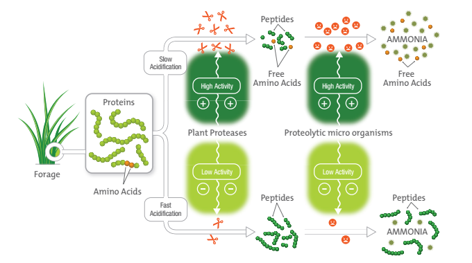
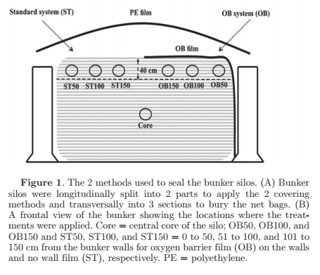

```{r setup, include=FALSE}
knitr::opts_chunk$set(echo = FALSE,warning = FALSE)
packages <- c("knitr",
              "shiny",
              "echarts4r",
              "openxlsx",
              "dplyr",
              "stringr",
              "gt")

installed_packages <- packages %in% rownames(installed.packages())
if (any(installed_packages == FALSE))
  install.packages(packages[!installed_packages])
invisible(lapply(packages, library, character.only = TRUE))
```

## Leistung

```{r} 
load("beelden/timeseries")
ts
```


## Grundfutter '24

-   Wetter Fruhjahr nass, Sommer gut, Herbst nass
-   Leistungen gut, Mais sehr gut
-   Qualität Grass Wechselhaft, noch einige Silages mit Buttersäure

## Futter für Milchkühe: 

**Ziele**

- Höhe erträge
- Gute Konservierung
- Ermöglichen gute Leistungen

**Was brauchen wir für gute Leistungen:**

- Gesunde Kühe
- Viel nährstoffen für Milchleistung

**Um welche Nährstoffen geht es?**

- Energie: NEL, Netto Energie Laktation: MJ
- Eiweiss: RP, nXP, MP: gram/kg TS
- Auch noch andere details

## Energie

Energie ist verbrennung:

<div style="display: flex; align-items: center; gap: 40px;">
  
  
</div>

## Berechnung Energie im Futter


```{r,echo=FALSE,warning = FALSE,results = 'asis'}
tab0 <- data.frame(Nutrient = c("Stärke",
                                "Fett",
                                "Faser",
                                "RP",
                                "ROM",
                                 "Asche"),
                   VE = c(17.7,
                          39.33,
                          17.6,
                          23.63,
                          16.73,0)) |> 
  gt(rowname_col = "Nutrient") |> 
  cols_label(VE = "VE Wert (MJ/kg)") |> 
  tab_footnote("ROM = Zucker, Fettsäuren, Glycerol, Lösliche Faser") 
tab0
```
{width=50%}

## Eiweiss





## Was brauchen wir:

**In Grasssilages**

- Schnelle und Komplete Trocknung im Feld
- Schnelle Ansäuerung im Silo
- Wenig Roh Asche/Sand
- Gute Inhaltstoffen
- Wenig Verlüste im Silo und nach Aussilieren

**In Maissilage**

- Gute Erträge und Qualität
- Gute bearbeitung Körner
- Schnelle Ansauerung im Silo
- Wenig Verlüste Im Silo und nach Aussilieren

## Faser

**Kuhe brauchen auch Faser**

<div style="display: flex; align-items: center; gap: 50px;">
  
  
</div>

**Zielwerten und Ergebnisse**

```{r,echo=FALSE,results='asis'}
tab <- read.xlsx("beelden/20250417_tabellen.xlsx",
                   sheet = "tabschudbox",
                   colNames = TRUE)
tab |> gt(id="two",rowname_col = "X1") |> 
  cols_label(X1 = "")

tab2 <- data.frame(Futter = c("Mais",
                              "Grass",
                              "Kraffutter",
                              "Gesamt"),
                   Anteil = c(56,
                              14.4,
                               28.6,NA),
                   PL = c(3,29,0,6))
tab2 |> gt(id = "three",
           rowname_col = "Futter") |> 
  cols_label(PL = "% >19mm") |> 
  sub_missing(missing_text = "")
                   

                   
```


<div class="rf">Quelle: https://extension.psu.edu/penn-state-particle-separator </div>


## Maiskörner

<div style="display: flex; align-items: center; gap: 50px;">
  
  
</div>


{width=60%}

<div class="rf">Quelle: https://en.engormix.com/feed-machinery/silage-forage/effect-corn-silage-kernel_a39557</div>

**Analyse Mais November 2024**

<iframe src="beelden/202410_maislego.PDF" width="800px" height="1000px"></iframe>


**Analyse Mais Januar 2025**

<iframe src="beelden/202501_maislego.PDF" width="800px" height="1000px"></iframe>

## Abdecken Silage



```{r,echo=FALSE,results='asis'}
tabl1 <- read.xlsx("beelden/20250417_tabellen.xlsx",
                   sheet = "tab1lima2017",
                   colNames = TRUE)

tabl1 |>
  gt(id="eight",rowname_col = "Item") |> 
    tab_header("Eigenschaften Abdeckfolie.")


tabl3 <- read.xlsx("beelden/20250417_tabellen.xlsx",
                   sheet = "tab3lima2017",
                   colNames = TRUE) 

tabl3 |> gt(id = "nine",rowname_col = 'item') |> 
  tab_header("Fermentation der Silage.")

tabl4 <- read.xlsx("beelden/20250417_tabellen.xlsx",,
                   sheet = "tab4lima2017",
                   colNames = TRUE)

tabl4 |> gt(id = "ten",rowname_col = 'item') |> 
  tab_header("Futterwert der Silage.") 

```


<div class="rf">Quelle: @Lima2017</div>

**Ziel Abdecken**

{width=60%}


## Ergebnisse Grass

**Grass Silo 2 Gr 2024**

<iframe src="beelden/silo2gross.PDF" width="800px" height="1000px"></iframe>


**Grass 2-3 S. Klein 3**

<iframe src="beelden/23schnitklein.PDF" width="800px" height="1000px"></iframe>


**Grass Silo 2 Klein 4e S.**

<iframe src="beelden/kleinsilo2.PDF" width="800px" height="1000px"></iframe>


**Grass Silo 3 Sarmstorf.**

<iframe src="beelden/silo3_st.PDF" width="800px" height="1000px"></iframe>


## Maissilage

- Silage besser abdecken, mehr verluste wenn nicht genug gewicht
- Körnerbearbeitung beobachten

## Grassilage

- Häckseln mit 5 cm länge
- Mit Nasse Silage: immer Mais einmischen

## Quellen


